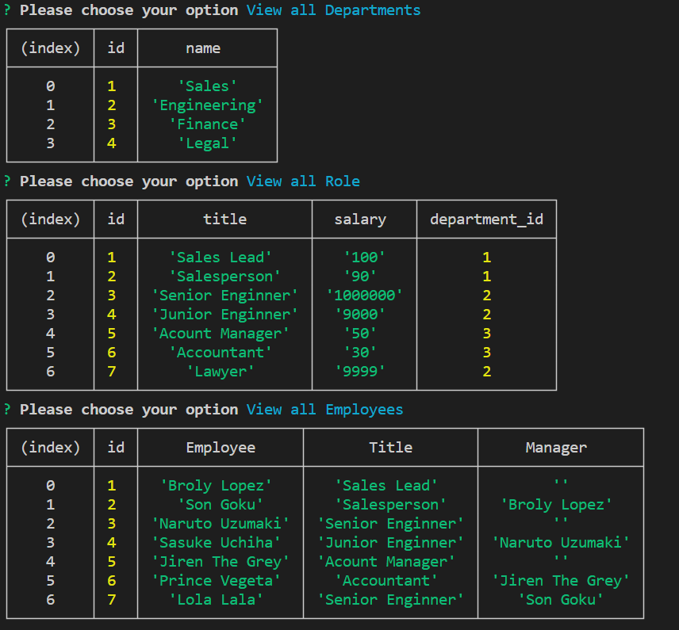

# employee-tracker

## Description
This project lets you create a Note-Taker, by using Express and saving data from a JSON file.

## Table of Contents
- [Installation](#installation)
- [Credits](#credits)
- [Usage](#usage)
- [Walk Through](#walk-through)
- [Deployment](#deployment)
- [License](#license)
- [Contact me](#contact-me)
## Installation

 You need to install Node.js , npm i inquirer, and mysql2.

## Credits 
Zachary Auerbach

Vidal Tan

## Usage

## Walk Through

https://drive.google.com/file/d/1s1PEN7kIa96tR2Roz_KLeNDotY6H3b2D/view

## Deployment

[GitHub Pages](https://github.com/GustavoTijerino1/employee-tracker)

## License

 MIT License

## Contact me
How to reach me if you have any additional questions.

[GitHub](https://github.com/GustavoTijerino1)

Email: busg26@gmail.com

